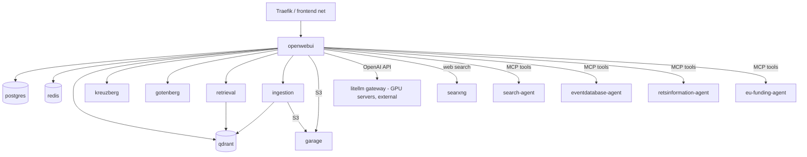

# AarhusAI developer setup

Docker setup with [Taskfile](https://taskfile.dev/) for local development of AarhusAI. This repo only orchestrates: 
cloning, patching, composing, backups and image builds. The source code for the individual parts lives in repositories
at [https://github.com/AarhusAI/](https://github.com/AarhusAI/)- 

## Architecture

### Services

Two compose stacks exist. `docker-compose.yml` is the **local dev** stack (builds `open-webui/` from source, Garage for
S3). `docker-compose.server.yml` is the **production/server** stack (pulls the prebuilt `itkdev/openwebui` image, Garage
for S3, SearXNG). Overlays add ARM support and agents. The LiteLLM model gateway is **not** part of these compose
files — it runs on GPU servers and Open WebUI reaches it over the network
(see [Connecting Open WebUI to LiteLLM](#connecting-open-webui-to-litellm)).

| Service                 | Stack  | Role                                                                                      |
|-------------------------|--------|-------------------------------------------------------------------------------------------|
| `openwebui`             | both   | Open WebUI backend + frontend; routed via Traefik on `COMPOSE_DOMAIN`, internal port 8080 |
| `postgres`              | both   | Open WebUI application database (Postgres 17)                                             |
| `redis`                 | both   | Websocket manager + cache                                                                 |
| `qdrant`                | both   | Vector store for RAG (ports 6333/6334)                                                    |
| `kreuzberg`             | both   | Document text extraction service (port 8000)                                              |
| `gotenberg`             | both   | Office/HTML → PDF conversion (port 3000)                                                  |
| `retrieval`             | both   | External RAG retrieval agent (`RAG/retrieval-agent`, port 8000)                           |
| `ingestion`             | both   | External RAG ingestion service (`RAG/ingestion-service`, port 8000)                       |
| `garage`                | both   | S3-compatible object storage (Garage, API 3900 / RPC 3901)                                |
| `garage-init`           | both   | One-shot: creates the S3 bucket and access keys in Garage                                 |
| `node`                  | dev    | One-shot Node container for the Vite frontend build                                       |
| `search-agent`          | agents | Web-search MCP tool server (port 8001)                                                    |
| `eventdatabase-agent`   | agents | Event-database MCP tool server (port 8000)                                                |
| `retsinformation-agent` | agents | Retsinformation-API MCP tool server (port 8000)                                           |
| `eu-funding-agent`      | agents | EU Funding & Tenders Portal MCP tool server (port 8000)                                   |

All containers join the internal `app` network; `openwebui` also joins the external `frontend` network (Traefik,
provided by `itkdev-docker-compose`). Services publish container ports only — there are no fixed host port mappings;
reach the UI through Traefik at `http://${COMPOSE_DOMAIN}`.

### Compose layering

`task compose` runs `docker-compose.yml` on amd64 and `docker-compose.yml -f docker-compose.arm.yml` on arm64. Other
overlays are added with extra `-f` flags (or via `include:`):

- **base** — `docker-compose.yml`: dev stack, builds `openwebui` from `open-webui/`.
- **arm** — `docker-compose.arm.yml`: overrides `openwebui.build.platforms` to `linux/arm64`. Auto-applied by
  `task compose` on arm64.
- **server** — `docker-compose.server.yml`: standalone production stack (prebuilt image, SearXNG). Not layered on base.
- **agents** — `docker-compose.agents.yml` (dev, builds from `agents/*`) / `docker-compose.server.agents.yml` (prod,
  prebuilt images). Both override `openwebui.TOOL_SERVER_CONNECTIONS` to register the MCP tool servers.



## Prerequisites

- **Docker** with the Compose plugin (`docker compose`).
- **Task** ([taskfile](https://taskfile.dev)) — the task runner.
- **Git**.
- **ITKDev docker compose** ([itkdev-docker-compose](https://github.com/itk-dev/devops_itkdev-docker)) — the default 
  compose wrapper (`DOCKER_COMPOSE` var). It provides Traefik and the external
  `frontend` network. To use plain Compose instead, set `TASK_DOCKER_COMPOSE="docker compose"` (you must then supply the
  `frontend` network and routing yourself).
- **curl** — patch tasks pipe PR `.diff` URLs into `git apply`.
- Access to the `AarhusAI/*` GitHub repos (fork + agents + RAG services).

**ARM / Apple Silicon:** `task compose` auto-adds `docker-compose.arm.yml` on arm64 hosts, which builds `openwebui` for
`linux/arm64`. The `db:*` and `s3:*` tasks apply the same overlay automatically on arm64.

## Quick start

```bash
# 1. Clone this repo and enter it
git clone https://github.com/aarhusai/aarhusai-docker.git aarhusai-docker && cd aarhusai-docker

# 2. Create .env from the template
task copy:config 

# 3. Replace placeholders in .env (CHANGE_ME_NOW / XXXX) with real values (see Configuration)

# 4. Clone the fork, reset to the pinned tag, apply patches, clone RAG services, pull images, start, build the frontend
task install
```

`task copy:config` only creates `.env` if missing; it does not overwrite. `.env.default` is a full template — every
variable is present, secrets redacted as `XXXX`/`sk-XXXX` and `CHANGE_ME_NOW`. You **replace the redacted placeholders**
with real values (local-dev set in 1Password, personalized API keys from devops). The admin rows ship working defaults
(`noreply@itkdev.dk` / `admin`) — change them for anything but throwaway local use. 

The placeholders that block a working stack:

- `WEBUI_SECRET_KEY` (ships `CHANGE_ME_NOW`)
- `OPENAI_API_BASE_URLS` / `OPENAI_API_KEYS` — LiteLLM gateway
- `RETRIEVAL_API_KEY` (used as `RAG_EXTERNAL_RETRIEVAL_API_KEY`) and the other `*_API_KEY`s for the RAG/embedding
  features you use
- the agent `*_SERVICE_API_KEY`s when running an agents overlay

Then open the UI:

```bash
task open  # https://webui.local.itkdev.dk
```

## Configuration

### `.env`

`.env.default` (copied to `.env` by `task copy:config`) mirrors the 1Password developer note with secrets redacted.
Variables:

| Variable                                                                              | Purpose                                                                       | Default                                                | Required             |
|---------------------------------------------------------------------------------------|-------------------------------------------------------------------------------|--------------------------------------------------------|----------------------|
| `COMPOSE_PROJECT_NAME`                                                                | Compose project name / Traefik router prefix                                  | `openwebui`                                            | yes                  |
| `COMPOSE_DOMAIN`                                                                      | Host Traefik routes the UI on; base of `BASE_URL`                             | `webui.local.itkdev.dk`                                | yes                  |
| `WEBUI_SECRET_KEY`                                                                    | Open WebUI session/JWT signing key                                            | `CHANGE_ME_NOW`                                        | yes                  |
| `OAUTH_CLIENT_ID`                                                                     | OIDC client id                                                                | `XXXXX`                                                | yes (for OIDC login) |
| `OAUTH_CLIENT_SECRET`                                                                 | OIDC client secret                                                            | `XXXX`                                                 | yes (for OIDC login) |
| `OPENID_PROVIDER_URL`                                                                 | OIDC discovery URL (Azure B2C)                                                | `https://aarhuskommunetest.b2clogin.com/...`           | yes (for OIDC login) |
| `OAUTH_PROVIDER_NAME`                                                                 | Display name of the OAuth provider                                            | `Aarhus Kommune`                                       | no                   |
| `OAUTH_SCOPES`                                                                        | OAuth scopes requested                                                        | `openid email`                                         | no                   |
| `OAUTH_EMAIL_CLAIM`                                                                   | Claim used as email                                                           | `upn`                                                  | no                   |
| `OAUTH_ROLES_CLAIM`                                                                   | Claim used for roles                                                          | `role`                                                 | no                   |
| `OAUTH_ADMIN_ROLES`                                                                   | Roles mapped to admin                                                         | `admin`                                                | no                   |
| `OAUTH_ALLOWED_ROLES`                                                                 | Roles allowed to log in                                                       | `admin,end-user,local-admin,builder`                   | no                   |
| `ENABLE_OAUTH_ROLE_MANAGEMENT`                                                        | Manage roles from OAuth claims                                                | `true`                                                 | no                   |
| `AAK_OAUTH_DEBUG_FORCE_ROLE`                                                          | Force a role for debugging (commented)                                        | —                                                      | no                   |
| `ENABLE_LOGIN_FORM`                                                                   | Show the local login form                                                     | `TRUE`                                                 | no                   |
| `ENABLE_SIGNUP`                                                                       | Allow local signup                                                            | `TRUE`                                                 | no                   |
| `OPENAI_API_BASE_URLS`                                                                | LiteLLM gateway base URL(s), `;`-separated                                    | `https://stgxxxx.itkdev.dk/v1;https://xxxx.itkdev.dk`  | yes                  |
| `OPENAI_API_KEYS`                                                                     | Gateway key(s), `;`-separated                                                 | `sk-XXXX;sk-XXXX`                                      | yes                  |
| `RAG_OPENAI_API_KEY`                                                                  | Key for the embedding endpoint (`RAG_OPENAI_API_BASE_URL`)                    | `XXXX`                                                 | yes (for RAG)        |
| `TTS_API_KEY`                                                                         | Key for the TTS endpoint                                                      | `XXXX`                                                 | no                   |
| `STT_API_KEY`                                                                         | Key for the STT endpoint                                                      | `XXXX`                                                 | no                   |
| `GLOBAL_LOG_LEVEL`                                                                    | Open WebUI log level                                                          | `DEBUG`                                                | no                   |
| `ENABLE_PERSISTENT_CONFIG`                                                            | Persist config in DB vs. env-driven                                           | `false`                                                | no                   |
| `ENABLE_OTEL` / `ENABLE_OTEL_METRICS`                                                 | OpenTelemetry export toggles                                                  | `false`                                                | no                   |
| `WEBUI_ADMIN_EMAIL`                                                                   | Bootstrap admin email                                                         | `noreply@itkdev.dk`                                    | yes                  |
| `WEBUI_ADMIN_PASSWORD`                                                                | Bootstrap admin password                                                      | `admin`                                                | yes                  |
| `SEARCH_AGENT_*`                                                                      | Web-search agent: provider, keys, LLM base/key/model, debug flags             | see file (`staan`, `AarhusAI-default-v2`, keys `XXXX`) | for search-agent     |
| `INGESTION_API_KEY`                                                                   | Auth key Open WebUI uses to call the ingestion service                        | `XXXX`                                                 | for ingestion        |
| `INGESTION_DEBUG` / `INGESTION_LOG_LEVEL*`                                            | Ingestion service logging                                                     | `false` / `INFO`                                       | no                   |
| `EXTERNAL_INGESTION_ENGINE`                                                           | Enable external ingestion engine                                              | `external`                                             | for ingestion        |
| `INGESTION_EMBEDDING_API_KEY`                                                         | Ingestion embedding key                                                       | `XXXX`                                                 | for ingestion        |
| `INGESTION_VISION_LLM_*`                                                              | Ingestion vision-LLM base/key/model                                           | see file (`AarhusAI-default-v2`)                       | for ingestion        |
| `RETRIEVAL_API_KEY`                                                                   | Auth key Open WebUI uses to call retrieval (`RAG_EXTERNAL_RETRIEVAL_API_KEY`) | `XXXX`                                                 | yes                  |
| `RETRIEVAL_LOG_LEVEL*`                                                                | Retrieval agent logging                                                       | `INFO`                                                 | no                   |
| `RETRIEVAL_AGENT_*`                                                                   | Retrieval agent LLM base/key/model                                            | see file (`AarhusAI-default-v2`)                       | for RAG              |
| `RETRIEVAL_EMBEDDING_*`                                                               | Retrieval embedding base/key/model                                            | see file (`multilingual-e5-large`)                     | for RAG              |
| `RETRIEVAL_ENABLE_RERANKING`                                                          | Enable reranking                                                              | `true`                                                 | no                   |
| `RETRIEVAL_RERANKER_*`                                                                | Reranker model/base/key                                                       | see file (`bge-reranker-v2-m3`)                        | for RAG              |
| `EVENT_DATABASE_SERVICE_API_KEY`                                                      | Bearer key Open WebUI uses for the event-database MCP tool                    | `XXXX`                                                 | for agents           |
| `EVENT_DATABASE_AGENT_API_KEY` / `EVENT_DATABASE_BASE_URL` / `EVENT_DATABASE_API_KEY` | Event-database agent's own LLM key, upstream API base + key                   | see file                                               | for event agent      |
| `RETSINFORMATION_SERVICE_API_KEY`                                                     | Bearer key for the retsinformation MCP tool                                   | `XXXX`                                                 | for agents           |
| `RETSINFORMATION_LLM_API_KEY`                                                         | Retsinformation agent LLM key                                                 | `sk-XXXX`                                              | for retsinfo agent   |
| `EU_FOUNDING_SERVICE_API_KEY`                                                         | Bearer key for the EU-funding MCP tool                                        | `XXXX`                                                 | for agents           |
| `EU_FOUNDING_AGENT_API_KEY`                                                           | EU-funding agent LLM key                                                      | `sk-XXXX`                                              | for EU-funding agent |

Values shown as `XXXX` / `sk-XXXX` / `CHANGE_ME_NOW` are redacted placeholders. A ready-made `.env` for local 
development (working OIDC on the https://webui.local.itkdev.dk domain, gateway keys, etc.) is in 1Password — secure note
**"Open-webui local developer (.env)"**. Personalized API keys are obtained from devops. Keep real secrets out of git;
`.env` is git-ignored and `.env.default` is the only committed template.

### Connecting Open WebUI to LiteLLM

Open WebUI talks to LiteLLM over the OpenAI-compatible API (`ENABLE_OPENAI_API: true`):

- `OPENAI_API_BASE_URLS` — LiteLLM gateway base URL (s) on the GPU servers, `;`-separated (`.env.default` ships a
  staging + prod pair, redacted). Set from the 1Password `.env`.
- `OPENAI_API_KEYS` — matching gateway key (s). Personalized keys come from devops.

Semicolon-separate the lists to configure multiple gateways.

## Tasks reference

Run `task` (or `task --list-all`) to list everything.

## Patch system

Open WebUI is a tagged upstream checkout in `open-webui/`; AarhusAI and OS2ai changes are applied on top as patches 
rather than committed into the tree. Each patch is a GitHub PR `.diff` on a fork, fetched with `curl` and applied with
`git apply`. Versions are pinned in `Taskfile.yml`: `OPEN_WEBUI_VERSION`, `OPEN_WEBUI_PREV_VERSION`, 
`PROD_OPEN_WEBUI_VERSION`.

### Patch sets

- **`PATCHES` (base)** — general fixes/features, from [os2ai/open-webui](https://github.com/os2ai/open-webui/pulls)`
- **`PATCHES_AARHUS`** — Aarhus-specific, from [AarhusAI/open-webui]((https://github.com/os2ai/open-webui/pulls))
- **`PATCHES_OS2`** — OS2ai only patches

### Applying patches

```bash
task git:reset        # clean checkout at OPEN_WEBUI_VERSION
task patch:aarhus     # or patch:os2ai / patch:base
```

Downloaded snapshots for offline reference / review live under `patches/<version>/{base,aarhus,os2}/` (populate with
`task patches:download`). We download these patches to ensure re-patching older version is possible.

### Rebasing onto a new upstream release

1. Bump `OPEN_WEBUI_VERSION` / `OPEN_WEBUI_PREV_VERSION` (and `PROD_OPEN_WEBUI_VERSION`) in `Taskfile.yml`.
2. Sync tags into the fork: `task git:sync:tags` (assumes `main`/`dev` already synced with upstream on GitHub).
3. Ensure the fork has an `upstream` remote with the new/old tags fetched.
4. `task patches:rebase` — for each branch: `git rebase --onto upstream/<new> upstream/<prev>`. Resolve conflicts per
   branch.
5. `task patches:force` to publish the rebased branches (force-push).
6. `task patches:download` to refresh the offline snapshots.
7. Reinstall / rebuild and verify.

Very often this is not possible to automate, has the upstream core changes too much between release, so step 4 to 6 
have to be done, one patch at a time, by hand.

### Contribution rules

- **Upstream-first.** Every change is a PR on the fork (`AarhusAI/open-webui` or `os2ai/open-webui`); the applied
  artifact is that PR's `.diff`. Add a new patch by adding its PR to `PATCHES`, `PATCHES_AARHUS` or `PATCHES_OS2` with
  its branch name.
- **Ticket-prefixed / referenced commits.** Patch changes carry a reference to their PR and ticket, e.g.
  `# PATCH (AarhusAI/open-webui#41, ticket 5511): …`.
- **Comment-wrapped patches.** Wrap each change in identifying comments so it survives rebases and stays greppable, e.g.
  `<!-- PATCH ADD BANNERS TO CHAT INPUT -->` … `<!-- /PATCH ADD BANNERS TO CHAT INPUT -->` in Svelte, or `# PATCH (...)`
  blocks in Python.

## Optional components

### Agents

Agent MCP tool servers are cloned into `agents/*` (`task agents:clone`, from the `AGENTS` list) and run via an overlay:

```bash
task compose -- -f docker-compose.agents.yml up --detach
```

The overlay overrides `openwebui.TOOL_SERVER_CONNECTIONS` to register `search-agent` (websearch, no auth),
`eventdatabase-agent`, `retsinformation-agent` and `eu-funding-agent` (bearer-auth, keys from `*_SERVICE_API_KEY`). The
`office-agent` repo is in the `AGENTS` clone list but has no compose service. RAG services (`retrieval`, `ingestion`)
are part of the base/server stacks, not this overlay.

### OAuth / OIDC

Open WebUI authenticates against an external OIDC provider (Azure B2C) via the `OAUTH_*` / `OPENID_PROVIDER_URL`
variables on the `openwebui` service. Set `OAUTH_CLIENT_ID`, `OAUTH_CLIENT_SECRET`, `OPENID_PROVIDER_URL`,
`OAUTH_PROVIDER_NAME` and the claim/role mappings in `.env`.

OIDC login works on the https://webui.local.itkdev.dk domain using the ready-made `.env` (see [`.env`](#env));
production uses Azure B2C. The former `docker-compose.oidc.yml` mock identity provider has been removed.

## Production builds

Production images build the `openwebui` service from `docker-compose.yml`
(`COMPOSE_BAKE=true docker compose --file docker-compose.yml build --no-cache --pull openwebui`), then tag and push at
`PROD_OPEN_WEBUI_VERSION` and `latest`. Each build first runs `prod:prepare` (git reset → apply patch set → bump npmrc):

| Task                  | Image                      | Patch set                      |
|-----------------------|----------------------------|--------------------------------|
| `prod:build:aarhusai` | `itkdev/openwebui`         | `patch:aarhus` (base + Aarhus) |
| `prod:build:os2ai`    | `ghcr.io/os2ai/open-webui` | `patch:os2ai` (base + OS2)     |

The server stack (`docker-compose.server.yml`) consumes `itkdev/openwebui:${OPENWEBUI_VERSION:-latest}`.

Build for `linux/arm64` by adding `-f docker-compose.arm.yml` (auto-applied by `task compose` on arm64 hosts), which
sets `openwebui.build.platforms`.

## Related repositories

- Fork: [AarhusAI/open-webui](https://github.com/AarhusAI/open-webui) (OS2 PRs
  against [os2ai/open-webui](https://github.com/os2ai/open-webui))
- RAG: [AarhusAI/ingestion-service](https://github.com/AarhusAI/ingestion-service), [AarhusAI/retrieval-agent](https://github.com/AarhusAI/retrieval-agent)
- Agents: 
  - [AarhusAI/search-agent](https://github.com/AarhusAI/search-agent)
  - [AarhusAI/eventdatabasen-agent](https://github.com/AarhusAI/eventdatabasen-agent)
  - [AarhusAI/retsinformation-api-agent](https://github.com/AarhusAI/retsinformation-api-agent)
  - [AarhusAI/office-agent](https://github.com/AarhusAI/office-agent)
  - [AarhusAI/eu-funding-tenders-portal-agent](https://github.com/AarhusAI/eu-funding-tenders-portal-agent)
